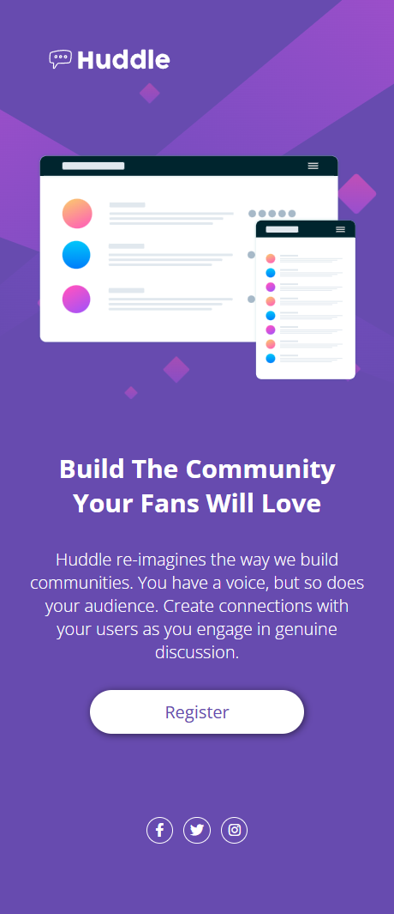

# Huddle Landing Page

Este projeto consiste em uma Landing Page da Huddle, desenvolvida como parte do curso DevQuest, inspirado no design do desafio do Frontend Mentor. O objetivo é aplicar e consolidar meus conhecimentos em HTML e CSS, criando um layout fiel ao design proposto, com foco em estrutura semântica, responsividade e boas práticas de codificação.

## Índice

- [Visão Geral](#visão-geral)
- [Funcionalidades](#funcionalidades)
- [Tecnologias Utilizadas](#tecnologias-utilizadas)
- [Screenshots](#screenshots)
- [Conclusão](#conlusão)
- [Autora](#autora)

## Visão Geral

Este é um desafio do Frontend Mentor que foi criado utilizando HTML e CSS para praticar e demonstrar meus conhecimentos.

## Funcionalidades

- Estrutura semântica
- Layout responsivo usando Flexbox
- Design moderno e interativo com animações e transições em CSS
- Compatibilidade com dispositivo móvel

## Tecnologias Utilizadas

- HTML5
- CSS3

## Screenshots

  
  

## Conclusão

> Foi um grande desafio fazer um projeto inteiro sozinha pela primeira vez, principalmente ao utilizar o flexbox e ao fazer o media query pois são nessas duas tecnologias que tenho mais dificuldade no momento, mas com estudo e dedicação pude aprimorar meus conhecimentos e coloca-los em prática. 

## Autora

[Waleska Malta - Linkedin](https://www.linkedin.com/in/walesmalta/)